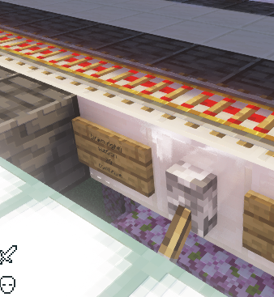
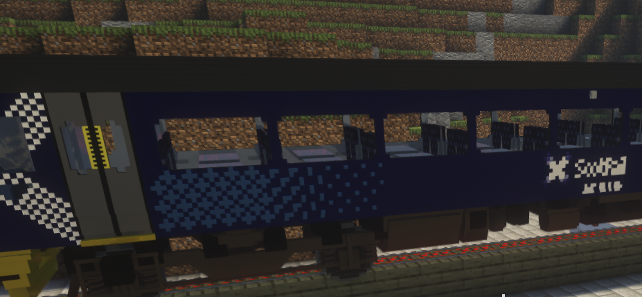
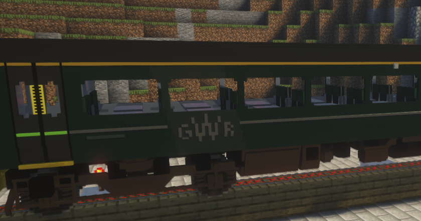
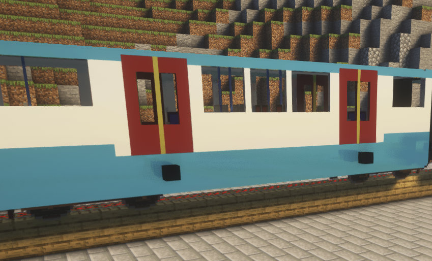
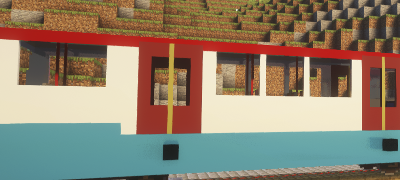
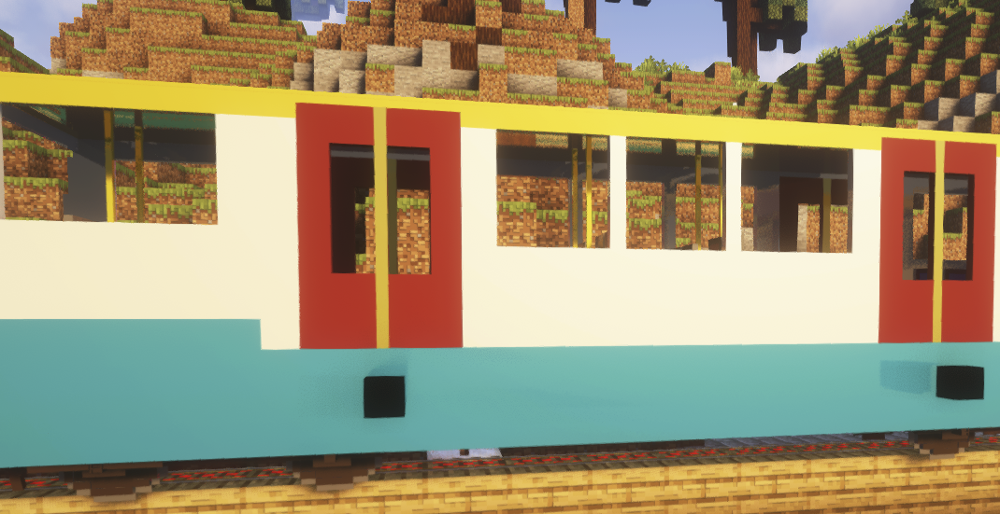

# MTR铁路系统

### MTR铁路建设权限申请条件
1.提供一张铁路(一条或一条以上)路线规划图(推荐使用[https://railmapgen.gitlab.io/?app=rmg](https://railmapgen.gitlab.io/?app=rmg))

2.提供一张MC地图内的铁路线路图(服务器客户端里面有JourneyMap，在游戏内按下J键就可以打开，在里面截一张图然后画上路线即可，绘画工具任意，画的能看得清楚就行)

3.联系管理员进行申请，上交保证书电子版(详见该文档之下的保证书文件)，并在游戏内支付管理员4000蕉币作为押金(若出现管理员乱收费现象，请联系服主进行处理)

### 操作教程
当你已经成功申请到MTR铁路建设系统权限时，你就可以按照该教程进行建设了。铺设铁路方面，按照原版即可，你需要学习的是告示牌设置的方法。

起点：

第一个告示牌：生成

> (train:left/right)
>
> spawn 发车间隔(x:xx格式，比如1:00就是一分钟) 发出车的速度 
>
> 车型
>

注：left和right只能填一个，代表着发车方向向左/右

车型包括以下几种：

class158 

class158_gwr

metro

metro_red

metro_yellow

第二个告示牌：目的地

> (train)
>
> property
>
> destination
>
> 目的地的名字(会在后面设置目的地的告示牌处设置)
>

注：每个告示牌都需要红石信号激活，建议用拉杆

途径站：

第一个告示牌：站点

> (train:left/right)
>
> station
>
> 停靠时长(单位:秒)
>
> continue
>

第二个告示牌：广播

> (train)
>
> announce
>
> 内容
>
> 内容
>

第三个告示牌：到站倒计时

> (train)
>
> trigger
>
> 站点名称
>
> 发车时长(与终点站设置一致)
>

第四个告示牌(挂在站点的其他显眼位置，不要摆在铁轨边上)：倒计时显示

这个告示牌没有固定的要求，按照你自己的需要在中间插入以下内容即可

%该站点名%：车辆到达该站还需要的时间

%time%：北京时间

终点站：

首先，仍然需要第一个告示牌：站点

> (train:left/right)
>
> station
>
> 停靠时长(单位:秒)
>
> continue
>

第二个告示牌：终点

> (train)
>
> destination
>
> 终点名字(英文)
>

第三个告示牌：破坏(这个一定要加，不然会有很多车辆堆积导致卡顿)

> (train)
>
> destroy
>

如果需要报站等，参照上面的

注意：一定要把这些告示牌用东西遮住，一是不美观，二是防止他人恶意更改

起点、终点一定要足够长，让这些车辆能够放得下，否则会出现BUG

若有不懂之处，请联系服主或者管理员，不过大部分管理员可能不懂这个(((
