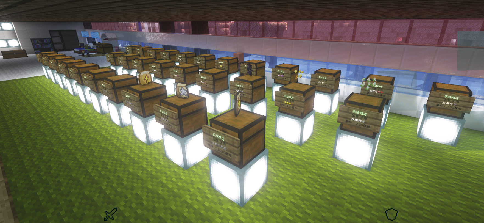
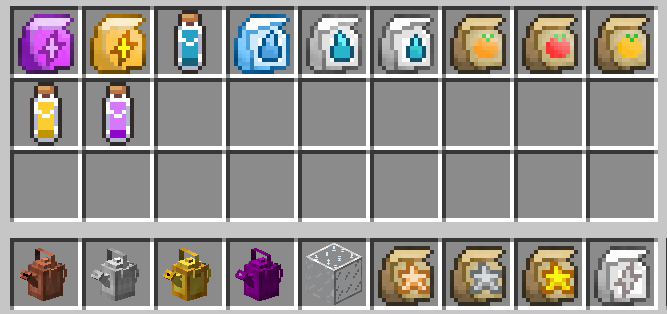
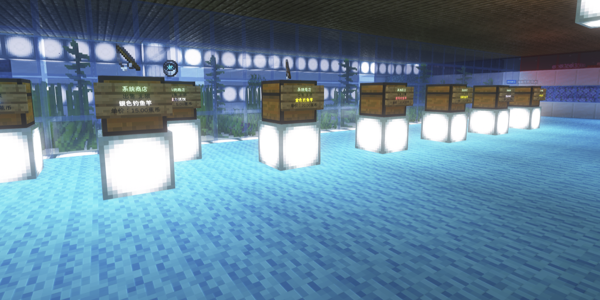
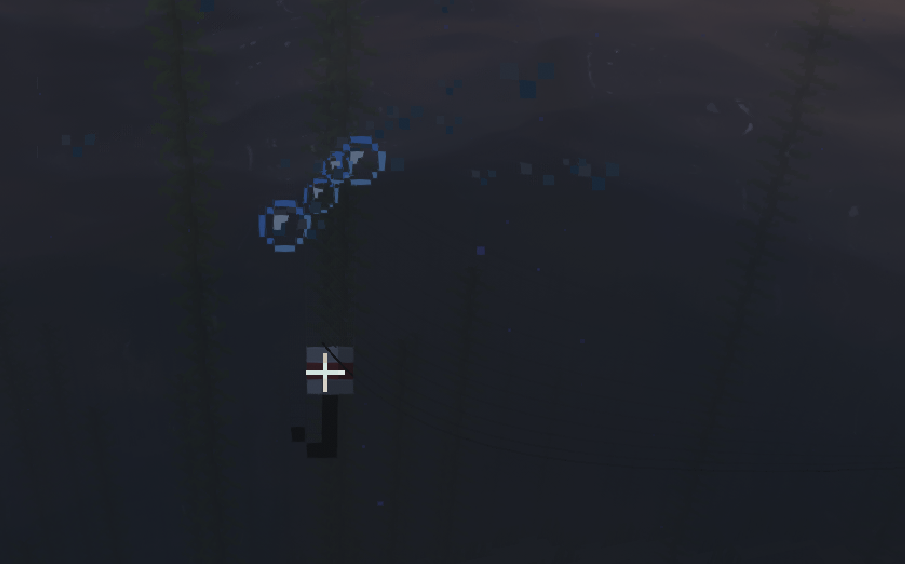
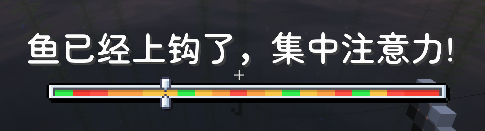
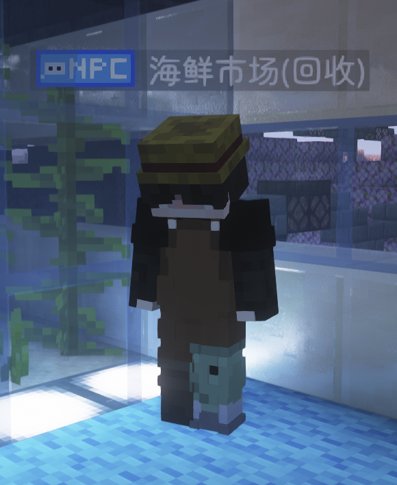
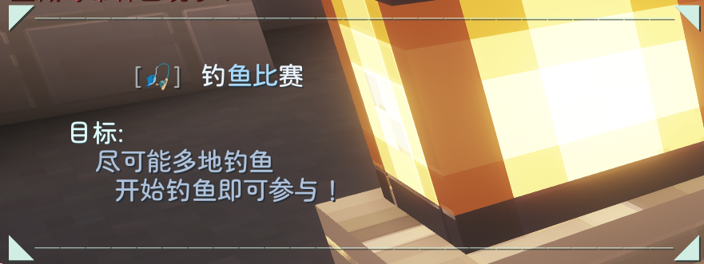
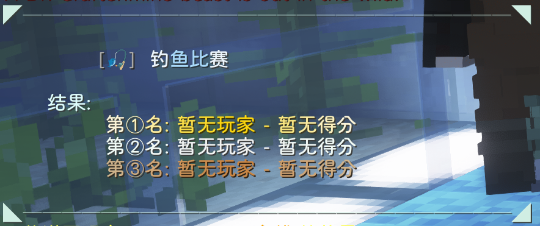

# 星露谷种植和钓鱼系统

### 星露谷种植系统
星露谷种植系统提供了许多不同种类的新增作物，每一种作物都有其适合种植的季节，如果季节不对，作物就无法种植(除非购买温室玻璃)，查看季节的方法，请转至“基础类指令”——“季节系统”这篇文章。

其作物的种植与原版相同，但是需要使用洒水壶从水中接水，再洒到耕地上。

服务器的作物商店位于主城商场二楼，在这里可以购买各种作物的种子

除了作物外，还有其他物品，在这里让我一一介绍

**各种肥料**——购买后对准作物右键，就可以让作物获得生长效果

**三种魔瓶**——提高获得巨大化作物的概率

**洒水壶**——四种洒水壶分别有不同的容量，提着洒水壶对准水右键就可以往里面装水，一直按右键，直到装满为止，然后就可以提着洒水壶对准耕地右键，让耕地获得湿润效果(注意：以上内容对原版作物无效！！！)

**温室玻璃**——在作物上方五格内放置温室玻璃，可以让作物在所有季节都能正常耕种

种植出来的作物分为普通作物、银星作物、金星作物，有些类型的作物还有巨大化作物。稀有程度为：普通＜银星＜金星

收获后，可以来到主城商场四楼回收商店进行售出，赚取蕉币

### 星露谷钓鱼系统
星露谷钓鱼系统提供了多种钓竿，在主城商场二楼的渔具商店可以购买到不同的钓竿，不同的钓竿有不同的效果。

|鱼竿名称|效果|注释（鱼竿描述）|
| ---- | ---- | ---- |
|新手钓鱼竿|1.等待时间倍率×1.5 2.钓鱼难度-8|专为钓鱼新手设计，新手钓手的最佳伙伴。增加等待时间，降低钓鱼难度。|
|银色钓鱼竿|银星鱼类捕获概率+8|精心打造，闪耀着光泽。追求银星级鱼类钓手的梦想钓具，提升银星鱼获取几率。|
|金色钓鱼竿|金星鱼类捕获概率+3|阳光下闪闪发光，奢华高级钓具典范，提升金星级鱼类获取几率。|
|星辰钓鱼竿|钓鱼游戏时长+15秒|星尘雕刻而成，沐浴宇宙能量，延长垂钓博弈时间。|
|骸骨钓鱼竿|支持岩浆水域钓鱼，可以在岩浆垂钓|古老骸骨锻造、注入黑暗魔法，突破普通鱼竿限制，能够在灼热岩浆中钓鱼。|
|魔法钓鱼竿|1.附魔书产出概率+10 2.等待时间倍率×3 额外条件：副手持有书本诱饵，消耗10级经验，抛竿扣除1级经验|奥术造物，依靠书本作为诱饵，垂钓获取附魔书；上钩等待时间大幅延长。|
|大师钓鱼竿|1.等待时间倍率×0.95 2.钓鱼难度+10 3.银星鱼概率+5、金星鱼概率+3|钓鱼工艺顶峰，大幅缩短鱼儿上钩等待时间，提高垂钓难度，提升高品质鱼类产出概率。|

用这些钓竿就可以前往水边进行钓鱼，此外，渔具商店还卖诱饵，买了诱饵之后，把诱饵放在副手进行钓鱼，就可以发挥诱饵的作用。

如果看见有这样的一排气泡朝着鱼竿的方向跑来，就说明有鱼过来了，此时需要集中注意力，当鱼竿被拉下去，会听见扑通一声，此时要按下鼠标右键，就能抓到鱼

鱼上钩之后，会出现这种类型的小游戏，如图所示的这一种，只需要在那个尺进入绿色区域后按下右键就可以钓到鱼；此外还有另一种，是一种鱼游向终点的，遇到这种时，你在按下提示的按键时，要时刻注意鱼旁边的那个条，如果那个条变成了红色，那么需要马上松开按下的键，让他保持在绿色，并不断让鱼前进到达终点。

如果钓到的鱼是非原版的，那么他就会分成普通、银星、金星，稀有程度为普通＜银星＜金星，而且这些鱼还有长度之分，越长的越值钱。

钓到鱼后，来到主城商场二楼的渔具商店，可以找到一个名字叫“海鲜市场(回收)”的渔夫NPC，跟他对话，进入海鲜市场GUI，就可以把鱼放进去，下面的红石块按钮会变成铁块，按下就可以获得蕉币(如果钓到辐射鱼，那是卖不了的，毕竟没人敢吃被核废水污染的鱼)；或者打开服务器菜单，找到海鲜市场选项，点左键也可以进入海鲜市场。

每一种鱼都有一种基数，以及倍率，卖鱼赚到的钱是这样计算的：

> 价钱=基数+长度*倍率
>

| 鱼类名称 | 尺寸区间 | 基数 | 倍率 |
| ---- | ---- | ---- | ---- |
| 辐射鱼 | - | - | - |
| 彩虹鱼 | - | 5 | - |
| 金枪鱼 | 15~50厘米 | 6 | 0.1 |
| 金枪鱼(银星) | 30~100厘米 | 10 | 0.1 |
| 金枪鱼(金星) | 80~190厘米 | 16 | 0.1 |
| 梭子鱼 | 5~15厘米 | 6 | 0.1 |
| 梭子鱼(银星) | 10~25厘米 | 8 | 0.1 |
| 梭子鱼(金星) | 15~30厘米 | 10 | 0.1 |
| 金鱼 | 2~3厘米 | 14 | 0.1 |
| 金鱼(银星) | 3~4厘米 | 16 | 0.1 |
| 金鱼(金星) | 4~7厘米 | 20 | 0.1 |
| 鲈鱼 | 5~12厘米 | 2 | 0.1 |
| 鲈鱼(银星) | 10~19厘米 | 2 | 0.1 |
| 鲈鱼(金星) | 20~39厘米 | 2 | 0.1 |
| 鲻鱼 | 1~3厘米 | 4 | 0.1 |
| 鲻鱼(银星) | 4~9厘米 | 6 | 0.1 |
| 鲻鱼(金星) | 10~20厘米 | 10 | 0.1 |
| 沙丁鱼 | 1~5厘米 | 2 | 0.1 |
| 沙丁鱼(银星) | 4~8厘米 | 2.6 | 0.1 |
| 沙丁鱼(金星) | 7~14厘米 | 3 | 0.1 |
| 鲤鱼 | 7~19厘米 | 2 | 0.1 |
| 鲤鱼(银星) | 15~28厘米 | 2.2 | 0.1 |
| 鲤鱼(金星) | 27~48厘米 | 2.4 | 0.1 |
| 鲶鱼 | 3~12厘米 | 2.8 | 0.1 |
| 鲶鱼(银星) | 10~28厘米 | 3.2 | 0.1 |
| 鲶鱼(金星) | 40~70厘米 | 5.4 | 0.1 |
| 章鱼 | 1~4厘米 | 6 | 0.1 |
| 章鱼(银星) | 4~12厘米 | 7.5 | 0.1 |
| 章鱼(金星) | 12~100厘米 | 9 | 0.1 |
| 翻车鱼 | 5~18厘米 | 2 | 0.1 |
| 翻车鱼(银星) | 17~28厘米 | 3.6 | 0.1 |
| 翻车鱼(金星) | 26~50厘米 | 5.2 | 0.1 |
| 红鲷鱼 | 1~4厘米 | 2 | 0.1 |
| 红鲷鱼(银星) | 3~12厘米 | 2 | 0.1 |
| 红鲷鱼(金星) | 9~18厘米 | 2 | 0.1 |
| 虚空鲑鱼 | 8~10厘米 | 4 | 0.1 |
| 虚空鲑鱼(银星) | 10~14厘米 | 10 | 0.1 |
| 虚空鲑鱼(金星) | 12~18厘米 | 20 | 0.1 |
| 林跳鱼 | 3~7厘米 | 2 | 0.1 |
| 林跳鱼(银星) | 7~18厘米 | 3.4 | 0.1 |
| 林跳鱼(金星) | 16~29厘米 | 5 | 0.1 |
| 鲟鱼 | 1~5厘米 | 20 | 0.1 |
| 鲟鱼(银星) | 5~15厘米 | 2.5 | 0.1 |
| 鲟鱼(金星) | 15~30厘米 | 30 | 0.1 |
| 蓝色水母 | 1~3厘米 | 4 | 0.1 |
| 蓝色水母(银星) | 3~5厘米 | 5 | 0.1 |
| 蓝色水母(金星) | 5~10厘米 | 6 | 0.1 |
| 粉色水母 | 1~3厘米 | 4 | 0.1 |
| 粉色水母(银星) | 3~5厘米 | 5 | 0.1 |
| 粉色水母(金星) | 5~10厘米 | 6 | 0.1 |

服务器还会时不时举行钓鱼比赛，当聊天框出现以下提示时，就说明钓鱼比赛开始了，此时只需要开始钓鱼，就会自动参与比赛。

比赛会评出前三名，这里因为没人参与，所以都是“暂无玩家 - 暂无得分”

