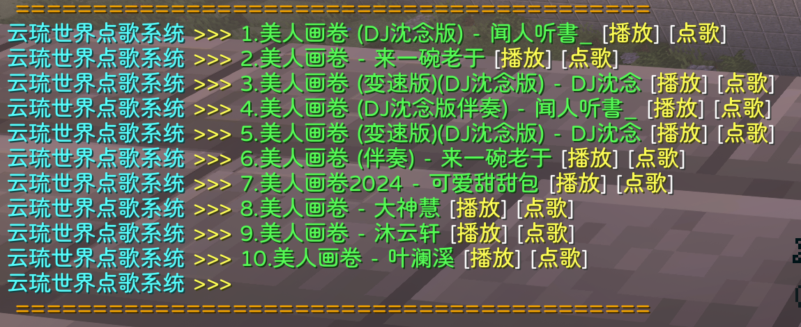

# 点歌

本服安装了ZMusic插件，这意味着你可以在服务器里点歌。

服务器客户端已经安装了配套的mod，所以你在服务器内可以直接点歌，无需另外安装mod

在服务器中，输入/zm search 163 歌名 即可在网易云音乐中搜索(我们只开通了网易云音乐的通道)，你可以播放VIP歌曲，因为我们绑定了有黑胶VIP的网易云账号。

示例：/zm search 163 美人画卷

选取正确的那一首，点击播放即可为自己播放，点击点歌可以把这首歌发到公屏，其他玩家想听的可以直接点击播放。点击停止即可停止播放，点击循环就是循环播放

