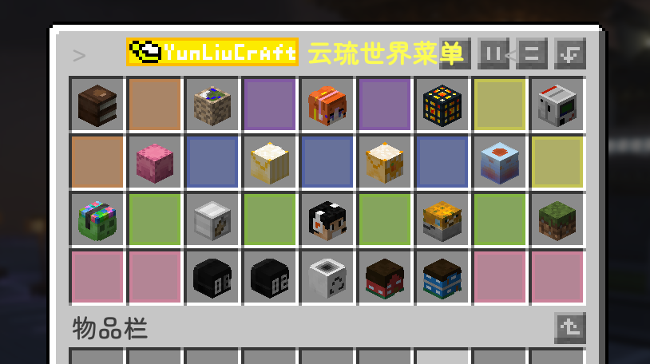
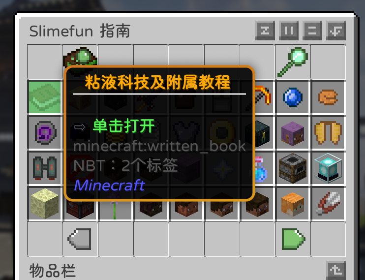

# 粘液科技

在进入游戏时，你一般会获得一个特殊的“书本”，右键即可打开

如果没有，也可以输入/sf guide获得或者输入/sf open_guide直接进入指南。当然，在服务器菜单中也有这个东西(第三行第一个)

随后，你就可以按照指南愉快地发展科技了！

这里推荐几个比较有用的粘液科技UP或者网站：

### 物品数据库
[Hikari Slimefun Database](https://hsd.hikari.bond/)

### 粘液科技教程UP主
[我的动力鞋的个人空间-我的动力鞋个人主页-哔哩哔哩视频](https://space.bilibili.com/6993041)

### 还有更多请查看粘液科技指南中“粘液科技及附属教程”模块
