# 精英怪与副本

### 在世界中到处刷新的精英怪
在游玩的过程中，经常可以看到如下的提示：

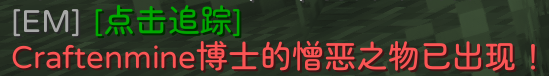

这时，你只需要点击“点击追踪”就可以得到定位

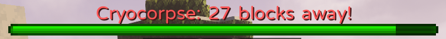

跟随定位所指示的距离进行寻找，便可寻找到相应的精英怪。

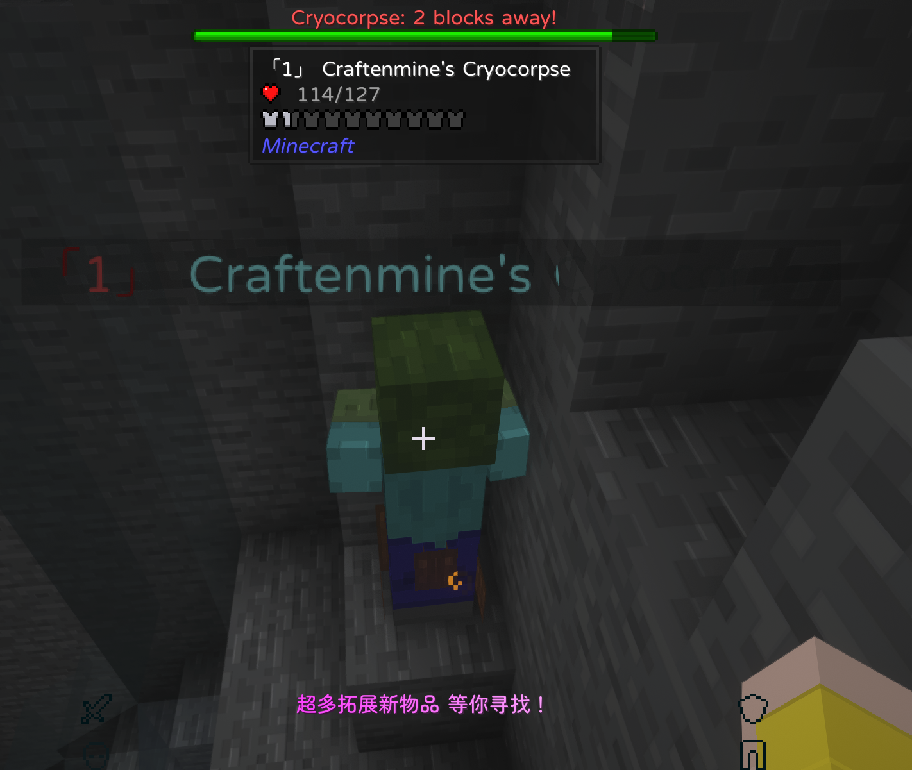

要挑战精英怪，一定要确保自己的装备和武器足够硬，否则你就会被精英怪暴虐。击败了精英怪后，可以获得一定的奖励。

### 探险家中心与副本
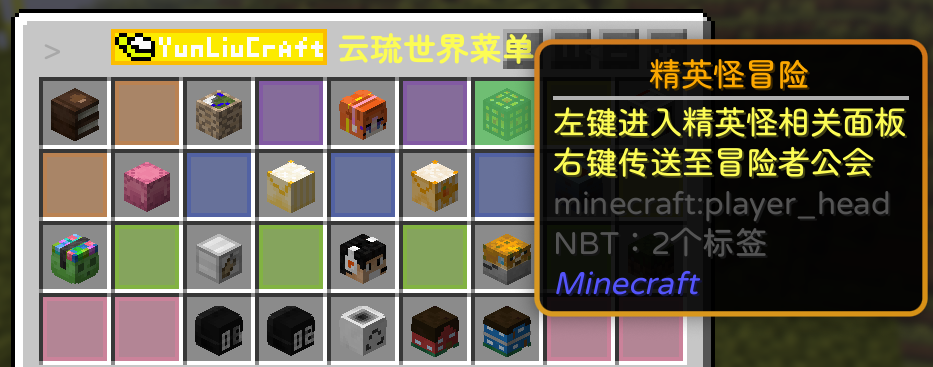

打开服务器菜单后，点击第一行第七格，左键可以进入相关面板

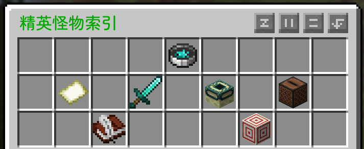

这里就不过多赘述，而右键即可传送到冒险者公会

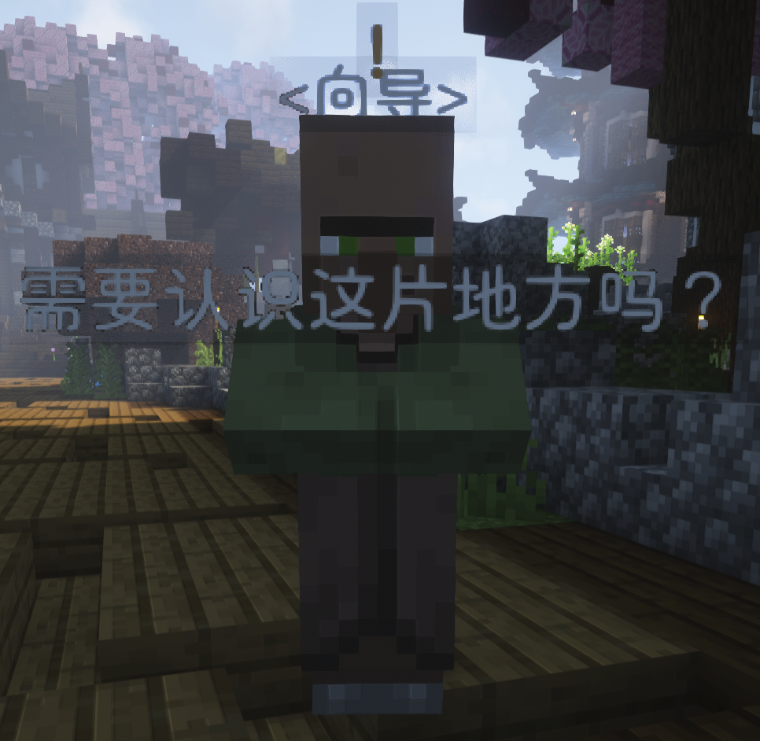

传送到冒险者中心后，先找到旁边的这位向导，右键他可以领取任务

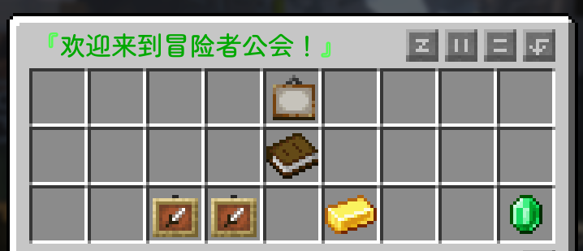

完成任务可以获得精英币，精英币可以用来购买物品和升级

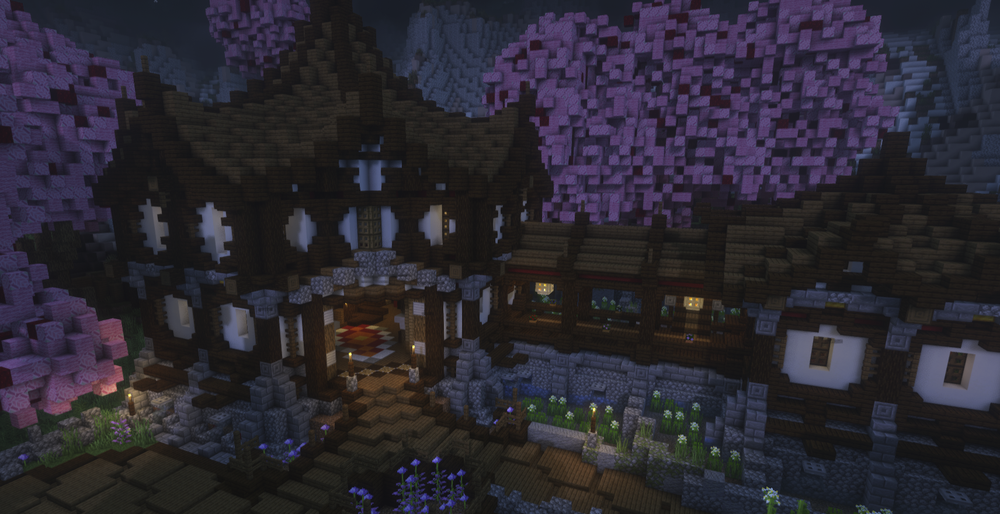

找到这个建筑，在里面可以找到公会向导和任务发布者

走过这个长廊，到另一边可以购买与出售特殊物品(可以买的东西很多，但需要使用精英币)，打boss或者精英怪获得的战利品可以来这里卖钱。

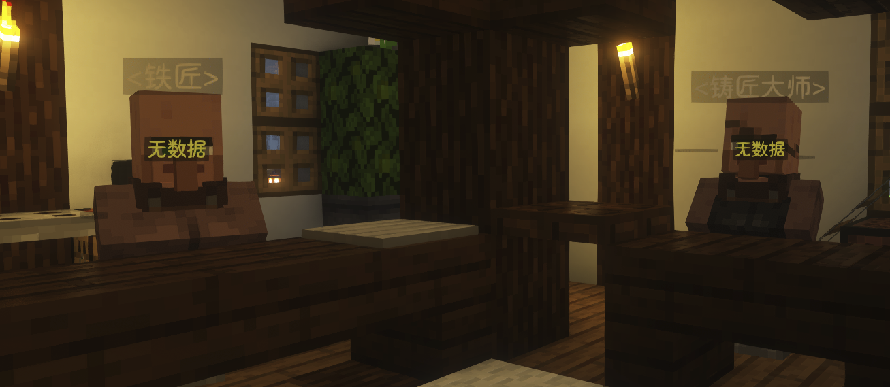

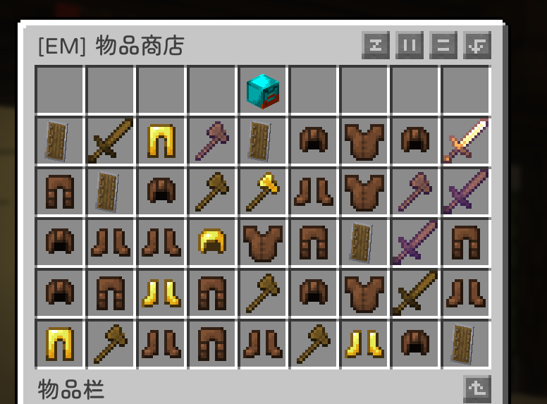

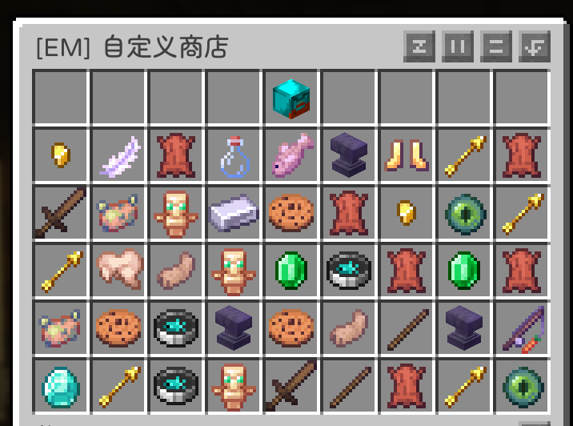

你以为只有这两个NPC吗？不，旁边还有下去的楼梯，下面还有很多NPC，比如解绑人、修理工、废品商，这些交给你们自己探索，都剧透了就没意思了((( 有啥不懂的反馈给我，我后续再补充上

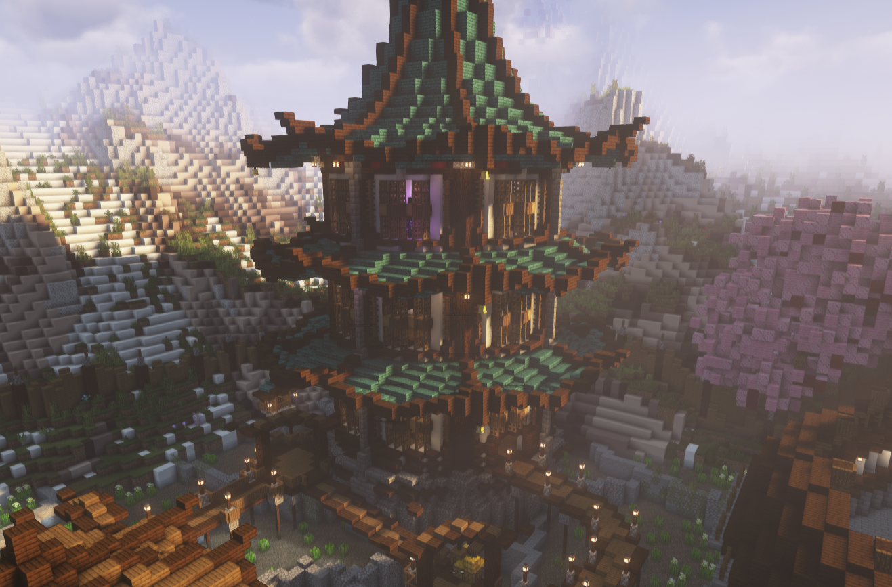

这个塔状的建筑，有不同副本的传送门，我在这里不再具体标注哪些传送门是有目的地的，你可以自己去试，碰到传送门，如果可以传送的那么就会被传走，无法传送的聊天框会提示你传送无效。副本里面有小精英怪和大BOSS，挑战它们之前一定要有一定的装备和武器，否则就会被上市( 建议带上自己的伙伴们一起去打，这样子会轻松很多。

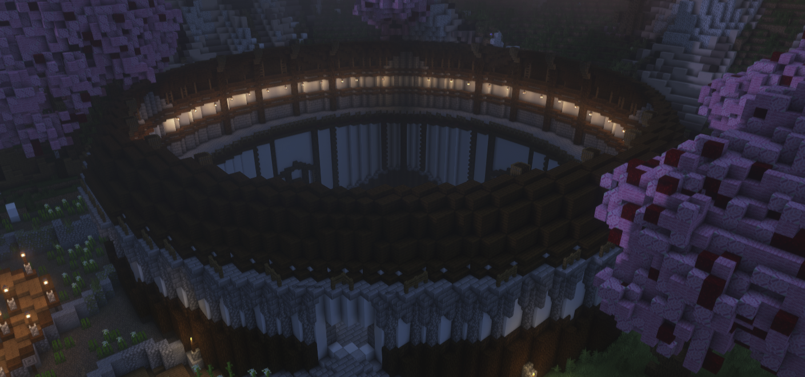

这个圆圆的，像客家土楼一样的建筑就是这里的竞技场。

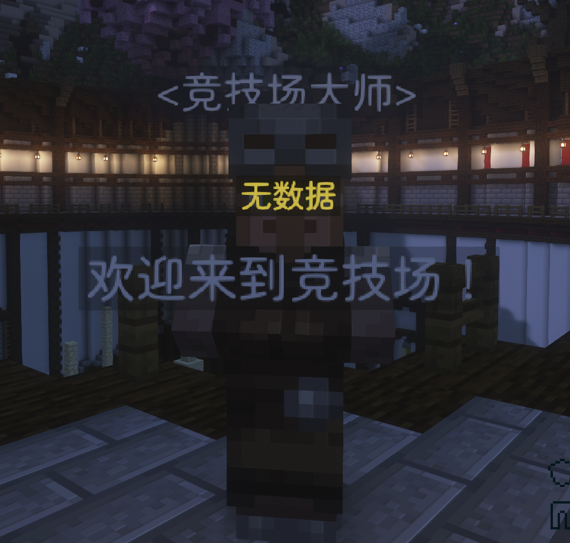

右键这个NPC，可以选择观战或者参加竞技，内容是对战多个批次的精英怪，也是一样，一定要做好准备，可以和别人一起。(望远镜是观战，钻石剑是参与)

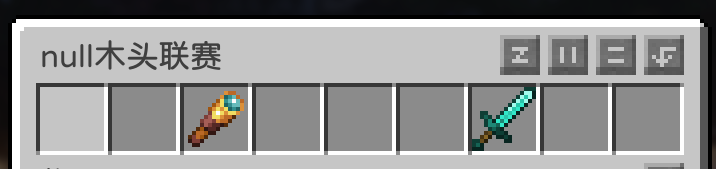

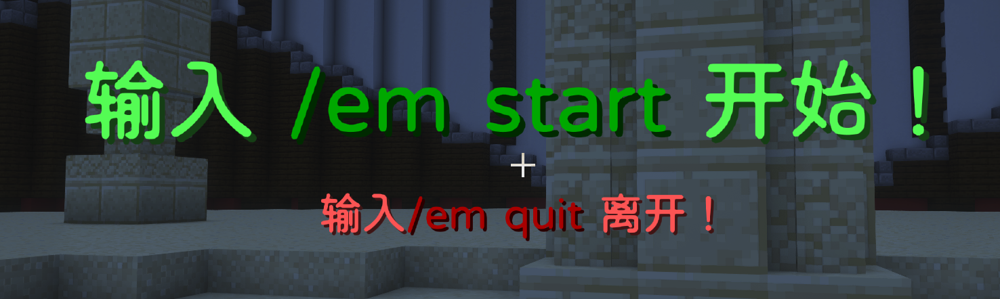

进入竞技场后，按照提示进行操作即可。

### 冒险者中心的地图
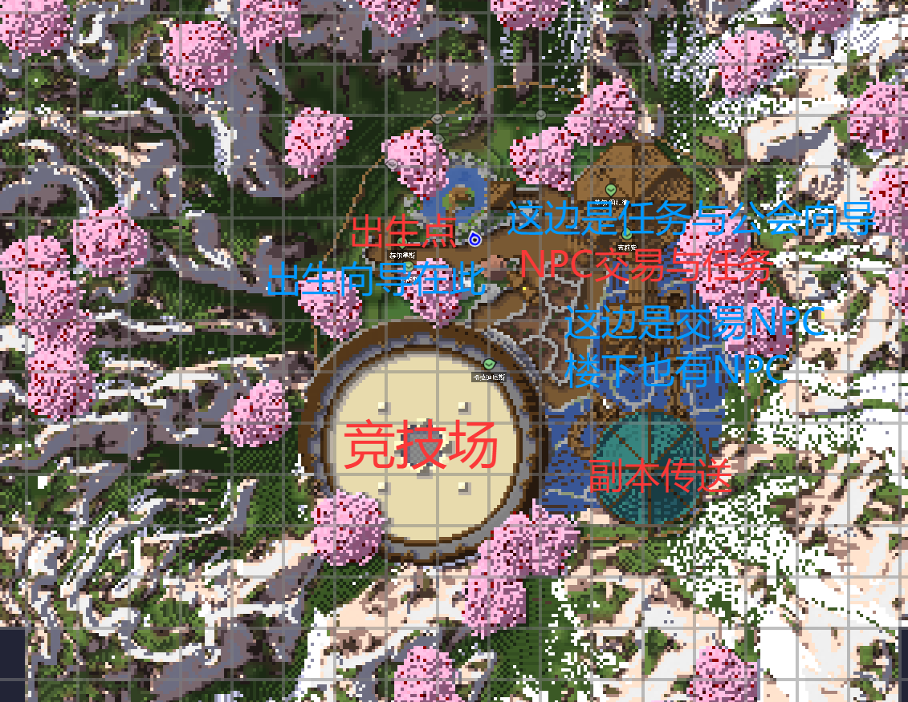
